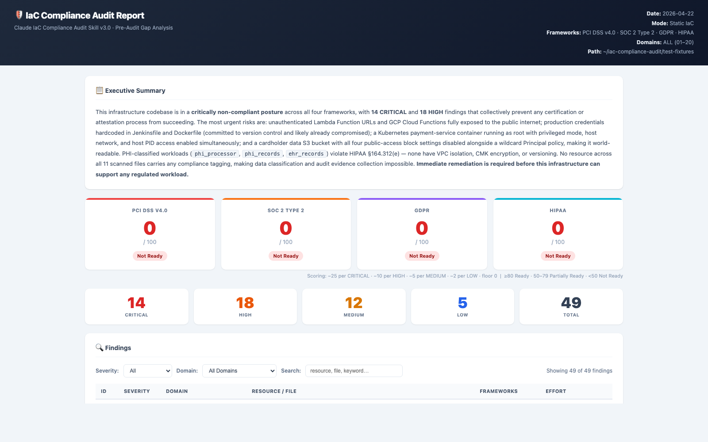

# IaC Compliance Audit

[](LICENSE)
[](https://docs.anthropic.com/en/docs/claude-code)
[]()

A **Claude Code skill** that performs pre-audit gap analysis across your infrastructure-as-code and live cloud environments, mapped to **PCI DSS v4.0**, **SOC 2 Type 2**, **GDPR**, **HIPAA**, **ISO 27001:2022**, **NIST CSF 2.0**, **NIST SP 800-53 Rev 5**, **CIS Controls v8**, and **OWASP Top 10 2021** — 9 frameworks, 22 security domains, 18+ IaC formats.

Run it as an interactive slash command locally, as a **GitHub Actions** check on every PR, as a **Jenkins** pipeline stage, or as a **git pre-push hook** that catches issues before they reach your remote.

---

## Dashboard Preview

Open [`docs/dashboard-snapshot.html`](docs/dashboard-snapshot.html) in a browser for a fully interactive sample report.



> The snapshot is generated from a deliberately misconfigured test environment (49 findings). A clean production environment will show far fewer findings.

---

## Table of Contents

- [How It Works](#how-it-works)
- [Architecture](#architecture)
- [What Gets Audited](#what-gets-audited)
- [Requirements](#requirements)
- [Quick Start](#quick-start)
- [Installation](#installation)
- [Local Usage](#local-usage)
- [Git Hooks](#git-hooks)
- [GitHub Actions](#github-actions)
- [Jenkins](#jenkins)
- [Report Formats](#report-formats)
- [Compliance Scoring](#compliance-scoring)
- [Security](#security)
- [Troubleshooting](#troubleshooting)
- [Contributing](#contributing)

---

## How It Works

```
Developer workstation or CI runner
        │
        ▼
┌───────────────────┐
│   Claude Code CLI  │  claude --print "/iac-audit --mode static --path ./infra"
│   (claude CLI)     │
└────────┬──────────┘
         │  invokes skill
         ▼
┌────────────────────────────────────────────────────────────────┐
│                  SKILL.md  (iac-audit skill)                   │
│                                                                │
│  1. Pre-flight check — verify CLI tools available              │
│  2. Discovery — find all IaC files in --path                   │
│  3. Static analysis — grep-based checks across 22 domains      │
│  4. Live cloud audit — AWS/GCP/Azure CLI queries (optional)    │
│  5. Scoring — per-framework compliance scores (0–100)          │
│  6. Output — text / interactive HTML dashboard / JSON          │
└────────────────────────────────────────────────────────────────┘
         │
         ▼
┌─────────────────────────────────────────────────────────────────┐
│  ci/scan.sh  (CI wrapper)                                       │
│  • Validates inputs and resolves paths                          │
│  • Installs the skill automatically                             │
│  • Invokes claude --print with a 10-minute timeout              │
│  • Parses CI summary footer from report                         │
│  • Writes GITHUB_OUTPUT and GITHUB_STEP_SUMMARY                 │
│  • Exits 0 (pass) or 1 (fail) based on --fail-on threshold      │
└─────────────────────────────────────────────────────────────────┘
```

### Two-tier local protection

```
git commit
    └─► pre-commit hook  (pure grep, no API, ~100ms)
        • Blocks CRITICAL: hardcoded secrets, open SSH to 0.0.0.0/0,
          privileged containers, root containers
        • Warns: unpinned Actions, publicly_accessible=true,
          unencrypted state backends

git push
    └─► pre-push hook  (full Claude audit, ~30-90s)
        • Checks if any IaC files changed — skips if not
        • Runs ci/scan.sh against the full repo
        • Blocks push if findings meet --fail-on threshold (default: HIGH)
        • Skips gracefully if ANTHROPIC_API_KEY not set
```

### CI/CD pipeline

```
Pull Request opened / push to main
    │
    ├─► static-audit job  (always)
    │       ├─ Checkout code
    │       ├─ Install Claude Code CLI (npm install -g @anthropic-ai/claude-code)
    │       ├─ Install iac-audit skill (copies SKILL.md)
    │       ├─ Run ci/scan.sh  ──► HTML report
    │       ├─ Upload report as artifact (30-day retention)
    │       ├─ Post/update PR comment with findings table
    │       └─ Fail job if findings ≥ fail-on threshold
    │
    ├─► live-aws-audit job  (push to main + ENABLE_LIVE_AWS_AUDIT=true)
    │       ├─ Configure AWS credentials
    │       └─ Run ci/scan.sh --mode live
    │
    └─► nightly-full-audit job  (schedule: Monday 02:00 UTC)
            ├─ Run ci/scan.sh --mode all
            └─ Open GitHub Issue if CRITICAL findings found
```

---

## Architecture

```
iac-compliance-audit/
│
├── skills/
│   └── iac-audit/
│       └── SKILL.md              ← Claude Code skill definition
│                                   Contains all 20 domain checks, compliance
│                                   control mappings, output templates, and
│                                   security constraints for the AI model.
│
├── ci/
│   ├── scan.sh                   ← CI/CD wrapper script
│   │                               Validates inputs, installs skill, invokes
│   │                               claude CLI, parses output, sets exit code.
│   ├── install-hooks.sh          ← One-command git hook installer
│   ├── Jenkinsfile.example       ← Drop-in Jenkins pipeline stage
│   └── hooks/
│       ├── pre-commit            ← Fast grep scan (no API, no network)
│       └── pre-push              ← Full Claude audit before push
│
├── .github/
│   ├── actions/
│   │   └── iac-audit/
│   │       └── action.yml        ← Reusable composite GitHub Action
│   └── workflows/
│       └── iac-audit.yml         ← Full workflow (PR + push + nightly)
│
├── docs/
│   ├── dashboard-snapshot.html   ← Sample self-contained HTML report
│   └── dashboard-preview.png     ← Screenshot for README
│
├── SECURITY.md                   ← Vulnerability disclosure policy
├── LICENSE                       ← MIT
└── marketplace.json              ← Claude Code Marketplace metadata
```

### Data flow (static mode)

```
Your repo
  └── *.tf, *.hcl, *.yaml, Dockerfile, Jenkinsfile, *.pkr.hcl, *.yml (CI/CD), Pulumi.yaml
        │
        │  grep patterns (22 domain checks)
        ▼
  Claude Code (claude --print)
        │  Anthropic API
        │  model: claude-sonnet-4-6
        ▼
  Compliance report
        │  HTML / JSON / Markdown
        ▼
  ci/scan.sh parses CI footer
        │
        ├── GitHub Actions: GITHUB_OUTPUT + GITHUB_STEP_SUMMARY
        ├── Artifacts: iac-audit-reports/iac-audit-<timestamp>.html
        └── Exit code: 0 (pass) or 1 (fail)
```

---

## What Gets Audited

**22 security domains** across 9 compliance frameworks:

| # | Domain | PCI DSS | SOC 2 | GDPR | HIPAA | ISO 27001 | NIST CSF | 800-53 | CIS | OWASP |
|---|---|---|---|---|---|---|---|---|---|---|
| 01 | Network Security | Req 1 | CC6.6 | Art.32 | §164.312(e) | A.8.20 | PR.AA-05 | SC-7 | CIS 12 | A05 |
| 02 | Encryption at Rest | Req 3 | CC6.1 | Art.25 | §164.312(a)(2)(iv) | A.8.24 | PR.DS-01 | SC-28 | CIS 3.11 | A02 |
| 03 | Encryption in Transit | Req 4 | CC6.7 | Art.32 | §164.312(e)(2)(ii) | A.8.24 | PR.DS-02 | SC-8 | CIS 3.10 | A02 |
| 04 | IAM & Access Control | Req 7,8 | CC6.1–3 | Art.25 | §164.312(a),(d) | A.5.15 | PR.AA-01 | AC-2,AC-6 | CIS 5,6 | A01 |
| 05 | Logging & Monitoring | Req 10 | CC7.2 | Art.33 | §164.312(b) | A.8.15 | DE.CM-01 | AU-2,AU-12 | CIS 8 | A09 |
| 06 | Container & Workload | Req 2,6 | CC7.1 | Art.25 | §164.312(c) | A.8.9 | PR.PS-01 | CM-7 | CIS 4,16 | A05 |
| 07 | CI/CD & Change Control | Req 6.4 | CC8.1 | Art.25 | §164.312(c) | A.8.32 | PR.PS-03 | CM-3,SA-10 | CIS 16 | A08 |
| 08 | Availability | Req 12.3 | A1.1 | Art.32 | §164.312(a)(2)(ii) | A.8.14 | PR.IR-04 | CP-10 | CIS 11 | A05 |
| 09 | Key & Secrets Mgmt | Req 3.7 | CC6.1 | Art.25 | §164.312(a)(2)(iv) | A.8.24 | PR.DS-01 | SC-12 | CIS 3,4 | A02 |
| 10 | Serverless Security | Req 6,7 | CC6.3 | Art.25 | §164.312(a) | A.8.9 | PR.PS-05 | CM-7 | CIS 2,12 | A01 |
| 11 | Database Security | Req 2,3,10 | CC6.1 | Art.25 | §164.312(a),(b) | A.8.9 | PR.DS-01 | SC-28 | CIS 3,4 | A03 |
| 12 | API Gateway & WAF | Req 1,6 | CC6.6 | Art.25 | §164.312(e) | A.8.23 | PR.AA-05 | SC-7 | CIS 12,16 | A01 |
| 13 | DNS & Certificates | Req 4 | CC6.7 | Art.32 | §164.312(e) | A.8.24 | PR.DS-02 | SC-17 | CIS 3.10 | A02 |
| 14 | Object Storage | Req 3,7 | CC6.1 | Art.5,25 | §164.312(a),(c) | A.8.20 | PR.DS-01 | SC-28 | CIS 3,12 | A01 |
| 15 | Message Queue & Events | Req 3,4 | CC6.1 | Art.32 | §164.312(e) | A.8.24 | PR.DS-01 | SC-28 | CIS 3.11 | A02 |
| 16 | Supply Chain | Req 6.3 | CC8.1 | Art.25 | §164.312(c) | A.5.19 | ID.SC-02 | SR-3,SA-12 | CIS 2,16 | A08 |
| 17 | Cross-Account Trust | Req 7,8 | CC6.2 | Art.25 | §164.312(a) | A.5.15 | PR.AA-05 | AC-2,AC-20 | CIS 5,6 | A01 |
| 18 | Data Classification | Req 3,9.4 | C1.1 | Art.5,30 | §164.312(a) | A.5.12 | ID.AM-05 | RA-2,MP-3 | CIS 3 | A02 |
| 19 | GDPR-Specific | — | — | Art.5,17,44 | — | A.5.33 | PR.DS-05 | AC-19 | — | A04 |
| 20 | HIPAA-Specific | — | — | — | §164.312 all | A.8.24 | PR.DS-01 | SC-28 | CIS 3,8 | A02 |
| 21 | Vulnerability Management | Req 6.3,11.3 | CC7.1 | Art.32 | §164.312(a) | A.8.8 | DE.CM-08 | RA-5,SI-2 | CIS 7 | A06 |
| 22 | Config Baseline & Hardening | Req 2.2 | CC7.1 | Art.32 | §164.312(c) | A.8.9 | PR.PS-01 | CM-6,CM-7 | CIS 4 | A05 |

**Supported IaC formats:**

| Format | Files / Patterns |
|---|---|
| Terraform / Terragrunt | `*.tf`, `*.hcl`, `*.tfvars` |
| Kubernetes | `*.yaml`, `*.yml` with `apiVersion:` |
| Helm | `Chart.yaml` + templates |
| Kustomize | `kustomization.yaml` |
| ArgoCD | `*.yaml` with `kind: Application` |
| GitHub Actions | `.github/workflows/*.yml` |
| GitLab CI | `.gitlab-ci.yml` |
| Azure Pipelines | `azure-pipelines.yml`, `.azure/pipelines/*.yml` |
| CircleCI | `.circleci/config.yml` |
| Google Cloud Build | `cloudbuild.yaml`, `cloudbuild.json` |
| Jenkins | `Jenkinsfile`, `*.jenkinsfile` |
| Docker | `Dockerfile`, `Dockerfile.*`, `docker-compose*.yml` |
| CloudFormation | `*.json`/`*.yaml` with `AWSTemplateFormatVersion` |
| Bicep / ARM | `*.bicep`, `*.json` with `Microsoft.` references |
| Ansible | `*.yml`/`*.yaml` with `hosts:`/`tasks:`, `ansible.cfg` |
| Packer | `*.pkr.hcl`, `*.pkr.json` |
| Pulumi | `Pulumi.yaml`, `Pulumi.*.yaml`, `index.ts`/`index.py` |

**Live cloud audit (requires CLI credentials):** AWS · GCP · Azure · Kubernetes

---

## Requirements

| Requirement | Version | Notes |
|---|---|---|
| [Claude Code CLI](https://docs.anthropic.com/en/docs/claude-code) | ≥ 2.0 | `npm install -g @anthropic-ai/claude-code` |
| Node.js | ≥ 18 | Required by Claude Code CLI |
| Bash | ≥ 3.2 | macOS default is 3.2, works fine |
| `ANTHROPIC_API_KEY` | — | Get from [console.anthropic.com](https://console.anthropic.com) |
| AWS CLI (optional) | ≥ 2.0 | For `--mode live --cloud AWS` |
| Google Cloud CLI (optional) | — | For `--mode live --cloud GCP` |
| Azure CLI (optional) | — | For `--mode live --cloud Azure` |
| `kubectl` (optional) | — | For live Kubernetes cluster audit |

---

## Quick Start

```bash
# 1. Clone and install the skill
git clone https://github.com/goku-70/iac-compliance-audit.git
mkdir -p ~/.claude/skills/iac-audit
cp iac-compliance-audit/skills/iac-audit/SKILL.md ~/.claude/skills/iac-audit/SKILL.md

# 2. Set your API key
export ANTHROPIC_API_KEY=sk-ant-...

# 3. Run an audit from Claude Code
cd your-infrastructure-repo
claude  # open Claude Code, then:
/iac-audit --mode static --path . --output html
```

The HTML report is printed to stdout. Redirect it to a file, or use `ci/scan.sh` which handles that automatically:

```bash
bash /path/to/iac-compliance-audit/ci/scan.sh --path . --output html --report-dir ./reports
open reports/latest.html
```

---

## Installation

### 1. Install the Claude Code skill

```bash
mkdir -p ~/.claude/skills/iac-audit
cp /path/to/iac-compliance-audit/skills/iac-audit/SKILL.md ~/.claude/skills/iac-audit/SKILL.md
```

Or, if you've cloned the repo, `ci/scan.sh` installs the skill automatically each time it runs.

### 2. Set your API key

```bash
# Add to shell profile for persistence
echo 'export ANTHROPIC_API_KEY=sk-ant-...' >> ~/.zshrc
source ~/.zshrc
```

### 3. Install git hooks (optional but recommended)

```bash
# From inside any repository you want to protect
bash /path/to/iac-compliance-audit/ci/install-hooks.sh

# To remove later
bash /path/to/iac-compliance-audit/ci/install-hooks.sh --uninstall
```

---

## Local Usage

Once the skill is installed, invoke it from any Claude Code session:

```bash
claude  # start Claude Code, then use the slash command:
```

### Basic examples

```
# Audit everything in the current directory
/iac-audit --mode static --path .

# Single framework
/iac-audit --mode static --framework PCI-DSS --path ./terraform
/iac-audit --mode static --framework ISO27001 --path ./infrastructure
/iac-audit --mode static --framework NIST-CSF --path .
/iac-audit --mode static --framework CIS --domain 21,22 --path .

# Single domain (Network Security only)
/iac-audit --mode static --domain 01 --path .

# Multiple domains
/iac-audit --mode static --domain 01,04,09 --path .

# Live AWS audit
/iac-audit --mode live --cloud AWS --framework ALL

# Combined static + live
/iac-audit --mode all --cloud AWS --path ./infra

# HTML report (pipe to file or use scan.sh)
/iac-audit --mode static --output html --fail-on CRITICAL --path .

# JSON output for tooling
/iac-audit --mode static --output json --fail-on HIGH --path .
```

### All flags

| Flag | Values | Default | Description |
|---|---|---|---|
| `--mode` | `static` \| `live` \| `all` | `all` | Static IaC analysis only / Live cloud queries only / Both |
| `--framework` | `PCI-DSS` \| `SOC2` \| `GDPR` \| `HIPAA` \| `ISO27001` \| `NIST-CSF` \| `NIST-800-53` \| `CIS` \| `OWASP` \| `ALL` | `ALL` | One or more frameworks (comma-separated) |
| `--cloud` | `AWS` \| `GCP` \| `Azure` \| `ALL` | `ALL` | Cloud provider for live mode |
| `--domain` | `01`–`22` \| `ALL` | `ALL` | Specific domain(s) or all 22 |
| `--path` | Any directory path | `.` | Root path for static scan |
| `--severity` | `CRITICAL` \| `HIGH` \| `ALL` | `ALL` | Minimum severity to include in output |
| `--output` | `text` \| `html` \| `json` | `text` | Report format |
| `--fail-on` | `CRITICAL` \| `HIGH` \| `MEDIUM` \| `ALL` \| `NONE` | `NONE` | CI/CD exit-code threshold |

### Using ci/scan.sh directly

`ci/scan.sh` is a thin wrapper that adds input validation, path traversal protection, timeout enforcement, report file management, and GitHub Actions integration:

```bash
bash ci/scan.sh \
  --path ./infra \
  --mode static \
  --framework ALL \
  --output html \
  --fail-on CRITICAL \
  --report-dir ./reports
```

All flags can also be set via environment variables (useful for CI secrets):

| Environment variable | Equivalent flag |
|---|---|
| `ANTHROPIC_API_KEY` | *(required)* |
| `IAC_AUDIT_PATH` | `--path` |
| `IAC_AUDIT_MODE` | `--mode` |
| `IAC_AUDIT_FRAMEWORK` | `--framework` |
| `IAC_AUDIT_SEVERITY` | `--severity` |
| `IAC_AUDIT_OUTPUT` | `--output` |
| `IAC_AUDIT_FAIL_ON` | `--fail-on` |
| `IAC_AUDIT_REPORT_DIR` | `--report-dir` |
| `IAC_AUDIT_DOMAIN` | `--domain` |
| `IAC_AUDIT_CLOUD` | `--cloud` |
| `IAC_AUDIT_TIMEOUT` | *(timeout in seconds, default 600)* |

**Exit codes:**
- `0` — no findings at or above the `--fail-on` threshold (or `--fail-on NONE`)
- `1` — findings found at or above the `--fail-on` threshold

---

## Git Hooks

### Install

```bash
# From inside any git repository you want to protect
bash /path/to/iac-compliance-audit/ci/install-hooks.sh
```

If you already have existing hooks, the installer chains the new hooks — both run in sequence.

### pre-commit (fast, no API key needed)

Runs in ~100ms on staged files only. Does **not** call the Anthropic API.

Blocks the commit on:
- Hardcoded AWS secret access keys
- Hardcoded passwords in Terraform (literal values, not variable references)
- GitHub PAT tokens (`ghp_*`, `github_pat_*`)
- Secrets baked into Dockerfile `ENV` instructions
- SSH (port 22) open to `0.0.0.0/0`
- All-traffic rules (`protocol = "-1"`) open to the world
- Privileged Kubernetes containers (`privileged: true`)
- Root containers (`runAsUser: 0`)

Warns (non-blocking) about:
- Unpinned GitHub Actions (`@main`, `@master`, `@HEAD`)
- `publicly_accessible = true` on database resources
- `encrypt = false` on Terraform state backends

```bash
# Skip if you absolutely need to (CI/CD will still catch it)
git commit --no-verify
```

### pre-push (full Claude audit)

Runs the full compliance audit before the push reaches the remote.

- Checks if any IaC files changed in the push — skips entirely if not
- Blocks push if findings meet the severity threshold (default: HIGH)
- Skips gracefully if `ANTHROPIC_API_KEY` is not set

```bash
# Configure the severity threshold
export IAC_AUDIT_FAIL_ON=CRITICAL   # only block on CRITICAL
export IAC_AUDIT_FAIL_ON=MEDIUM     # block on MEDIUM and above

# Skip if needed
git push --no-verify
```

### Uninstall

```bash
bash /path/to/iac-compliance-audit/ci/install-hooks.sh --uninstall
```

---

## GitHub Actions

### Setup

1. Add your Anthropic API key as a repository secret:
   **Settings → Secrets and variables → Actions → New repository secret**
   Name: `ANTHROPIC_API_KEY`

2. Copy the workflow to your repo:

```bash
mkdir -p .github/workflows
cp /path/to/iac-compliance-audit/.github/workflows/iac-audit.yml .github/workflows/
```

Or reference the action directly in an existing workflow.

### Using the reusable action

```yaml
jobs:
  compliance:
    runs-on: ubuntu-latest
    permissions:
      contents: read
      pull-requests: write

    steps:
      - uses: actions/checkout@v4

      - name: IaC Compliance Audit
        uses: goku-70/iac-compliance-audit/.github/actions/iac-audit@main
        with:
          anthropic-api-key: ${{ secrets.ANTHROPIC_API_KEY }}
          scan-path: "."
          framework: ALL
          fail-on: CRITICAL
          output-format: html
```

### Action inputs

| Input | Required | Default | Description |
|---|---|---|---|
| `anthropic-api-key` | **Yes** | — | From `secrets.ANTHROPIC_API_KEY` |
| `scan-path` | No | `.` | Directory to scan (relative to repo root) |
| `mode` | No | `static` | `static` \| `live` \| `all` |
| `framework` | No | `ALL` | `PCI-DSS` \| `SOC2` \| `GDPR` \| `HIPAA` \| `ISO27001` \| `NIST-CSF` \| `NIST-800-53` \| `CIS` \| `OWASP` \| `ALL` |
| `fail-on` | No | `CRITICAL` | Severity threshold for non-zero exit |
| `output-format` | No | `html` | `html` \| `json` \| `text` |
| `severity` | No | `ALL` | Minimum severity to include in report |
| `domain` | No | `ALL` | Specific domains: `01,04,09,21,22` or `ALL` |
| `cloud` | No | `ALL` | Cloud provider for live mode |

### Action outputs

| Output | Description |
|---|---|
| `critical` | Number of CRITICAL findings |
| `high` | Number of HIGH findings |
| `medium` | Number of MEDIUM findings |
| `low` | Number of LOW findings |
| `report-file` | Absolute path to the generated report file |
| `exit-code` | `0` = pass, `1` = findings at or above `fail-on` threshold |

Use outputs in subsequent steps:

```yaml
- name: IaC Audit
  id: audit
  uses: goku-70/iac-compliance-audit/.github/actions/iac-audit@main
  with:
    anthropic-api-key: ${{ secrets.ANTHROPIC_API_KEY }}

- name: Gate on findings
  if: steps.audit.outputs.critical != '0'
  run: |
    echo "Found ${{ steps.audit.outputs.critical }} CRITICAL findings"
    exit 1
```

### What the bundled workflow provides

The bundled `iac-audit.yml` workflow includes three jobs:

<details>
<summary><strong>Job 1: Static audit</strong> — runs on every PR and push to main</summary>

```yaml
on:
  pull_request:
    paths: ["**.tf", "**.hcl", "**.yaml", "**.yml", "**/Dockerfile", "**/Jenkinsfile"]
  push:
    branches: [main, master]
    paths: ["**.tf", "**.hcl", "**/Dockerfile", "**/Jenkinsfile"]
```

- Runs `ci/scan.sh --mode static --fail-on CRITICAL`
- Uploads HTML report as artifact (30-day retention)
- Posts/updates a findings table comment on the PR:

```
## IaC Compliance Audit — ❌ FAILED

| Severity | Count |
|---|---|
| 🔴 CRITICAL | 2 |
| 🟠 HIGH | 5 |
| 🟡 MEDIUM | 8 |
| 🔵 LOW | 3 |

View full HTML report → (download iac-audit-report-42 artifact)

> ❌ Build gate triggered: findings at or above CRITICAL severity found.
```

</details>

<details>
<summary><strong>Job 2: Live AWS audit</strong> — push to main only, opt-in</summary>

Requires:
- `vars.ENABLE_LIVE_AWS_AUDIT = 'true'` (repository variable)
- `secrets.AWS_ACCESS_KEY_ID` and `secrets.AWS_SECRET_ACCESS_KEY`

Or swap for OIDC role-based auth (recommended for production):

```yaml
- uses: aws-actions/configure-aws-credentials@v4
  with:
    role-to-assume: ${{ vars.AWS_AUDIT_ROLE_ARN }}
    aws-region: us-east-1
```

</details>

<details>
<summary><strong>Job 3: Nightly full audit</strong> — scheduled Monday 02:00 UTC</summary>

- Runs static + live scan (if AWS credentials configured)
- Automatically opens a GitHub Issue if CRITICAL findings are found:

```
[IaC Audit] 3 CRITICAL + 7 HIGH findings — 2026-04-28

The scheduled compliance audit found 3 CRITICAL and 7 HIGH findings.
View full audit report — download the iac-audit-report artifact.

Action required: Assign this issue to the infrastructure team.
Frameworks: PCI DSS v4.0 · SOC 2 Type 2 · GDPR · HIPAA · ISO 27001:2022 · NIST CSF 2.0 · NIST 800-53 · CIS Controls v8 · OWASP Top 10
```

</details>

### Workflow triggers summary

| Trigger | Jobs that run |
|---|---|
| PR touching `*.tf`, `*.hcl`, `*.yaml`, `*.yml`, `Dockerfile`, `Jenkinsfile` | `static-audit` |
| Push to `main`/`master` touching `*.tf`, `*.hcl`, `Dockerfile`, `Jenkinsfile` | `static-audit` + `live-aws-audit` (if enabled) |
| Manual dispatch (`workflow_dispatch`) | `static-audit` (with custom params) |
| Schedule (Monday 02:00 UTC) | `nightly-full-audit` |

---

## Jenkins

Copy the stage from `ci/Jenkinsfile.example` into your existing Jenkinsfile.

**Prerequisites:**
- Jenkins credential `anthropic-api-key` (Secret Text) — the Anthropic API key
- `node` and `npm` available on the Jenkins agent

```groovy
stage('IaC Compliance Audit') {
    environment {
        ANTHROPIC_API_KEY = credentials('anthropic-api-key')
        IAC_AUDIT_FAIL_ON = 'CRITICAL'
        IAC_AUDIT_OUTPUT  = 'html'
        IAC_AUDIT_MODE    = 'static'
    }
    steps {
        script {
            // Install skill
            sh '''
                mkdir -p ~/.claude/skills/iac-audit
                cp skills/iac-audit/SKILL.md ~/.claude/skills/iac-audit/SKILL.md
            '''

            // Run — capture exit code before archiving
            def auditExit = sh(
                script: '''
                    bash ci/scan.sh \
                      --path . \
                      --mode static \
                      --framework ALL \
                      --output html \
                      --fail-on CRITICAL \
                      --report-dir ./iac-audit-reports
                ''',
                returnStatus: true
            )

            // Archive HTML report (always, even on failure)
            archiveArtifacts(
                artifacts: 'iac-audit-reports/**',
                allowEmptyArchive: true
            )

            // Publish as a tab in the Jenkins UI
            publishHTML(target: [
                reportDir:   'iac-audit-reports',
                reportFiles: 'latest.html',
                reportName:  'IaC Compliance Report'
            ])

            // Fail the build now if audit failed
            if (auditExit != 0) {
                error("IaC Compliance Audit FAILED — check the IaC Compliance Report tab.")
            }
        }
    }
}
```

See [`ci/Jenkinsfile.example`](ci/Jenkinsfile.example) for the full pipeline including email notification.

---

## Report Formats

### HTML (recommended for sharing)

Self-contained interactive dashboard. No CDN dependencies — works offline and can be safely emailed or attached to tickets.

**Contains:**
- Summary bar: total findings by severity
- Compliance score cards: per-framework score (0–100) with Ready / Partial / Not Ready status
- Interactive findings table: filter by severity, domain, free-text search; click any row to expand full issue detail, audit impact, and remediation with code snippets
- Cross-domain risk chains: multi-finding scenarios showing how vulnerabilities compound
- Remediation roadmap: prioritised action list linked to finding IDs (clicking a finding ID scrolls and highlights the row)
- Compliance coverage matrix: pass/fail for all 22 domains × 9 frameworks
- Print-friendly CSS (`@media print`) for PDF export

```bash
# Generate and save
bash ci/scan.sh --path ./infra --output html --report-dir ./reports
open reports/latest.html
```

### JSON (for tooling integration)

Machine-readable. Ingest into SIEM, ticketing, or custom dashboards.

```json
{
  "audit_date": "2026-04-22",
  "mode": "static",
  "framework": "ALL",
  "path": "/home/runner/work/myrepo",
  "summary": {
    "critical": 2, "high": 5, "medium": 8, "low": 3, "total": 18,
    "exit_code": 1
  },
  "scores": {
    "pci_dss": 55, "soc2": 60, "gdpr": 45, "hipaa": 50,
    "iso27001": 62, "nist_csf": 58, "nist_800_53": 54, "cis": 65, "owasp": 70
  },
  "findings": [
    {
      "id": "F-001",
      "domain": "01",
      "domain_name": "Network Security",
      "severity": "CRITICAL",
      "framework": ["PCI-DSS", "SOC2", "HIPAA"],
      "control": "PCI Req 1 / SOC 2 CC6.6",
      "issue": "Security group allows unrestricted SSH (0.0.0.0/0) on port 22",
      "file": "terraform/networking.tf",
      "line": 14,
      "impact": "Any internet host can attempt SSH brute-force or exploit known SSH vulnerabilities",
      "remediation": "Restrict cidr_blocks to known management IPs or use AWS SSM Session Manager",
      "remediation_code": "cidr_blocks = [\"10.0.0.0/8\"]"
    }
  ]
}
```

### Text (default, for terminal review)

Markdown-formatted, printed directly to the Claude Code terminal. Good for quick local checks.

### CI machine-readable footer

Every output format includes a machine-readable comment at the end. `ci/scan.sh` uses this to extract counts and exit code without parsing the full report:

```
<!-- IAC_AUDIT_CI: {"critical":2,"high":5,"medium":8,"low":3,"exit_code":1,"scores":{"pci":55,"soc2":60,"gdpr":45,"hipaa":50,"iso27001":62,"nist_csf":58,"nist_800_53":54,"cis":65,"owasp":70}} -->
```

---

## Compliance Scoring

Each framework starts at **100** and deducts points per finding:

| Severity | Deduction |
|---|---|
| CRITICAL | −25 per finding |
| HIGH | −10 per finding |
| MEDIUM | −5 per finding |
| LOW | −2 per finding |

Scores floor at **0**.

| Score | Status |
|---|---|
| ≥ 80 | ✅ Audit Ready |
| 50–79 | ⚠️ Partial Compliance |
| < 50 | ❌ Not Ready |

---

## Security

This tool is designed to audit other people's infrastructure, so it has strict security constraints of its own.

### What the tool does

- Reads local IaC files and calls configured cloud CLIs (AWS, GCP, Azure) — nothing else
- Sends only file content and grep results to the Anthropic API for analysis
- Outputs reports to stdout (HTML/JSON/text) — never writes files itself
- `ci/scan.sh` handles all file persistence via shell redirection

### What the tool never does

- Writes API keys, credentials, or environment variables to disk, logs, or report output
- Makes calls to any service other than the Anthropic API
- Modifies any infrastructure (read-only in all modes)
- Follows symlinks outside the specified `--path` directory

### Key security properties

| Property | Implementation |
|---|---|
| **Path traversal protection** | `ci/scan.sh` checks the raw `--path` value for `..` before and after `realpath` resolution |
| **Input validation** | All CLI flags are validated against an explicit allowlist before use |
| **API key hygiene** | Key is read from env only; never logged, echoed, or written to disk |
| **Supply-chain protection** | All `uses:` in `action.yml` are pinned to full SHA — tag mutation cannot alter behavior |
| **Least-privilege CI** | Workflow requests only `contents: read`, `pull-requests: write`, `actions: read` |
| **Offline-safe reports** | HTML reports have zero external resource requests — safe for air-gapped environments |
| **Timeout enforcement** | `claude --print` runs under `timeout 600` — no unbounded CI hang possible |

### Reporting a vulnerability

See [SECURITY.md](SECURITY.md). Please use GitHub Security Advisories rather than opening a public issue.

---

## Troubleshooting

<details>
<summary><strong>claude: command not found</strong></summary>

```bash
npm install -g @anthropic-ai/claude-code
# Verify:
claude --version
```

</details>

<details>
<summary><strong>ANTHROPIC_API_KEY is not set</strong></summary>

```bash
export ANTHROPIC_API_KEY=sk-ant-...
# Make it permanent:
echo 'export ANTHROPIC_API_KEY=sk-ant-...' >> ~/.zshrc && source ~/.zshrc
```

</details>

<details>
<summary><strong>SKILL.md not found</strong></summary>

```bash
# Install the skill manually:
mkdir -p ~/.claude/skills/iac-audit
cp /path/to/iac-compliance-audit/skills/iac-audit/SKILL.md ~/.claude/skills/iac-audit/SKILL.md
```

</details>

<details>
<summary><strong>GitHub Actions: ANTHROPIC_API_KEY not set (warning, job passes)</strong></summary>

The action skips gracefully if the secret is missing. To enable automatic auditing:

1. Go to your repo → **Settings → Secrets and variables → Actions**
2. Click **New repository secret**
3. Name: `ANTHROPIC_API_KEY`, Value: your Anthropic API key

</details>

<details>
<summary><strong>GitHub Actions: workflow doesn't trigger on my push</strong></summary>

The push trigger only fires for changes to `*.tf`, `*.hcl`, `Dockerfile`, and `Jenkinsfile`. It intentionally excludes `*.yml`/`*.yaml` on push to prevent the workflow from re-triggering itself when workflow files are updated.

YAML changes on PRs do trigger the check (the PR trigger still includes them).

To trigger manually: **Actions → IaC Compliance Audit → Run workflow**.

</details>

<details>
<summary><strong>pre-commit hook crashes on macOS</strong></summary>

The hooks use `grep -r` and avoid any GNU-only flags (`xargs -r`, `grep -P`, etc.). If you see an error, check which shell is running the hook:

```bash
head -1 .git/hooks/pre-commit  # should be: #!/usr/bin/env bash
bash --version                  # should be ≥ 3.2
```

</details>

<details>
<summary><strong>pre-push runs even when I only changed docs</strong></summary>

The pre-push hook checks whether any `.tf`, `.hcl`, `.yaml`, `.yml`, `Dockerfile`, or `Jenkinsfile` changed in the push. If not, it exits immediately.

To skip explicitly: `git push --no-verify`

</details>

<details>
<summary><strong>Audit times out in CI</strong></summary>

The default timeout is 10 minutes (600 seconds). Increase it:

```yaml
env:
  IAC_AUDIT_TIMEOUT: "1200"  # 20 minutes
```

Or narrow the scope: use `--domain 01,04,09` to audit only specific domains.

</details>

---

## Contributing

Issues and pull requests are welcome.

When adding new compliance checks to `skills/iac-audit/SKILL.md`:

1. Add the grep pattern to the appropriate `[S-NN]` section
2. Map the finding to the relevant control reference in the domain table
3. Include a `remediation_code` example showing the correct configuration
4. Test against both valid and invalid IaC samples

When modifying `ci/scan.sh` or the hooks:

- Verify on both macOS (bash 3.2) and Linux (bash 5.x)
- Do not use `xargs -r` (GNU-only), `grep -P` (GNU-only), or `sed -i` without the `.bak` argument (BSD/macOS requires it)
- All CI-facing changes should be tested with `ANTHROPIC_API_KEY` unset to confirm graceful skip behavior

---

## License

[MIT](LICENSE) — Copyright (c) 2026 Gokulnath Gopinath
